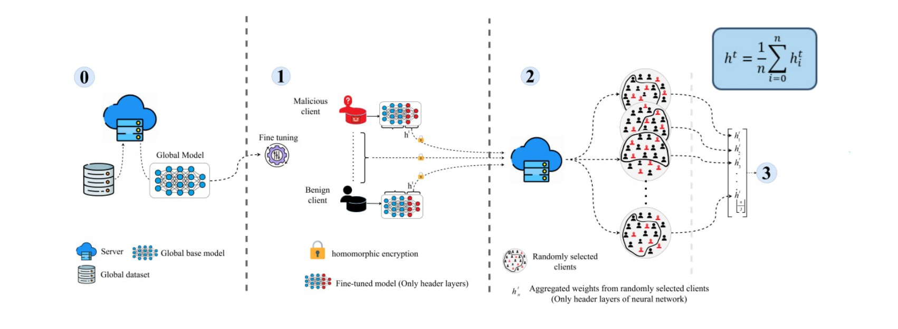
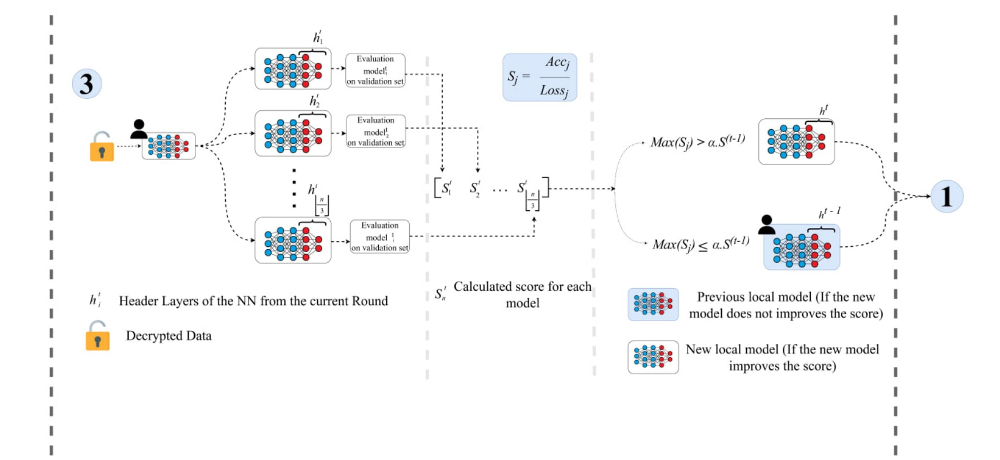

# FedBagSafe: Robust and Personalized Federated Learning Framework

<p align="center">
  <a href="https://www.python.org/">
    
  </a>
  <a href="https://pytorch.org/">
    
  </a>
  <a href="https://www.pytorchlightning.ai/">
    
  </a>
  <a href="https://github.com/OpenMined/TenSEAL">
    
  </a>
  <a href="LICENSE">
    
  </a>
</p>

<p align="center">
  <a href="https://papers.ssrn.com/sol3/papers.cfm?abstract_id=5867902">
    
  </a>
</p>

**FedBagSafe** is a robust and personalized federated learning framework designed for adversarial and non-IID environments. It combines bagged aggregation, homomorphic encryption, and an adaptive fail-safe mechanism to improve resilience, privacy, and stability during federated training.

---

## Overview

FedBagSafe is built to support secure and configurable federated learning experiments with modular components for data handling, model training, encrypted aggregation, and adaptive client-side model selection. The framework is designed for research on robustness, personalization, and attack resilience in federated learning.

<p align="center">
  
</p>

*Figure 1: First phase of FedBagSafe showing server-side bagged multi-aggregation with HE-based encrypted head-layer aggregation.*

<p align="center">
  
</p>

*Figure 2: Second phase of FedBagSafe showing client-side evaluation, model selection, and adaptive fail-safe acceptance.*

---

## Key Features

- **Robust Bagged Aggregation:** Samples multiple overlapping client subsets per round to reduce adversarial influence.
- **Homomorphic Encryption (HE):** Supports CKKS-based encrypted aggregation via TenSEAL.
- **Modular Configuration:** Uses YAML files and CLI arguments for flexible experiment control.
- **Adversarial Scenario Support:** Includes label flipping, backdoor, and model poisoning attacks.
- **Personalized Fine-Tuning:** Updates only the head layers to reduce communication cost and improve personalization.
- **Adaptive Fail-Safe:** Accepts a new local model only if it improves validation performance beyond a threshold.

---

## Motivation

Federated learning often suffers from non-IID data, malicious clients, and unstable training dynamics. FedBagSafe addresses these issues by combining robust aggregation with client-side validation and encrypted communication of sensitive model updates. This makes the framework suitable for experiments that require both security and personalization.

---

## Method Summary

FedBagSafe follows two main stages in each communication round:

1. **Server-side bagged multi-aggregation:** The server samples overlapping subsets of clients and aggregates their encrypted head-layer updates to generate several candidate models.
2. **Client-side evaluation and fail-safe selection:** Each client evaluates candidate models on a global validation set and keeps the best one only if it exceeds the adaptive acceptance threshold.

This design helps reduce the impact of poisoned clients while avoiding abrupt drops in accuracy from low-quality updates.

---

## Repository Structure

```text
├── config/
│   ├── config.yaml          # Master configuration file
│   └── config_parser.py     # YAML and CLI argument parser
├── data/
│   ├── dataset_loader.py    # CIFAR-10/100, FashionMNIST, FEMNIST loaders
│   ├── dataset_modes.py     # Attack mode definitions
│   └── data_utils.py        # Non-IID Dirichlet distribution tools
├── evaluation/
│   └── evaluator.py         # Model evaluation and metrics computation
├── models/
│   ├── base_model.py        # PyTorch Lightning base module
│   ├── model_factory.py     # Checkpoint and architecture loading
│   └── resnet*.py           # ResNet9 and CIFAR-ResNet variants
├── security/
│   ├── encryption.py        # TenSEAL CKKS encryption context
│   └── aggregation_he.py    # Secure encrypted aggregation
├── training/
│   ├── federated_trainer.py  # Main FL loop & phase scheduler
│   ├── local_trainer.py      # Client-side training logic
│   └── aggregation.py       # Bagging & selective weighted average
├── utils/
│   ├── logging_utils.py     # Verbose and file logging
│   ├── seed_utils.py        # Reproducibility constraints
│   └── device_utils.py      # CPU/CUDA device management
└── main.py                  # Framework entry point
```

---

## Installation

### 1. Clone the repository

```bash
git clone https://github.com/Spitamo/FedBagSafe.git
cd FedBagSafe
```

### 2. Install dependencies

Requires Python 3.8+.

```bash
pip install torch torchvision pytorch-lightning numpy pyyaml
```

### 3. Optional: Install TenSEAL for homomorphic encryption

```bash
pip install tenseal
```

> Note: For FEMNIST, ensure that the preprocessed `flattened_emnist.pt` file is placed in the project root directory.

---

## Usage

FedBagSafe can be executed through `main.py`. Configuration can be provided through the YAML file, command-line arguments, or both, where CLI arguments override YAML settings.

### Standard Runs

```bash
# Run using the default configuration file
python main.py --config config/config.yaml

# Override dataset and enable homomorphic encryption
python main.py --dataset fashionmnist --enable-he

# Run CIFAR-10 with a custom round count and disabled HE
python main.py --dataset cifar10 --disable-he --n-rounds 50
```

### Configuration Example

```yaml
dataset:
  mode: fashionmnist
federated:
  n_nodes: 100
  n_rounds: 100
attack:
  enabled: true
  malicious_clients: 24
encryption:
  enabled: false
  type: CKKS
```

---

## Experimental Phases

FedBagSafe is evaluated through a phased stress-test schedule over communication rounds:

1. **Stable Initialization:** Benign training establishes a baseline.
2. **Gradual Attack Introduction:** Intermittent backdoor and label-flipping attacks begin.
3. **Moderate and High Intensity:** Sustained, combined poisoning attacks are introduced.
4. **Recovery Validation:** The system returns to benign training to measure resilience.

The framework tracks **Clean Accuracy**, **Cross-Entropy Loss**, and **Backdoor Attack Success Rate (ASR)** during evaluation.

---

## Reproducibility

The framework includes utilities for seed control and logging to support reproducible experiments. For reliable comparisons, keep the same dataset split, attack schedule, number of clients, and encryption settings across runs.

Recommended reporting settings:
- Dataset and preprocessing pipeline.
- Number of clients and participation ratio.
- Attack type, intensity, and schedule.
- Aggregation parameters and fail-safe threshold.
- Validation metric used for model selection.

---

## Citation

If you use FedBagSafe in your research, please cite the associated paper.

```bibtex
@misc{fedbagsafe,
  title  = {FedBagSafe: Bagged Adaptive Selection and Fail-Safe Aggregation for Robust, Privacy-Preserving, and Personalized Federated Learning},
  author = {Ebrahimi Atani, Reza and Razavi, Seyed Saeed and Dadashi Pakdeh, Soroosh and Vasegh Rahimparvar, Arsalan},
  year   = {2026},
  url    = {https://ssrn.com/abstract=5867902},
  doi    = {10.2139/ssrn.5867902},
  note   = {Available at SSRN}
}
```

---

## License

This project is licensed under the MIT License. See the [LICENSE](LICENSE) file for details.